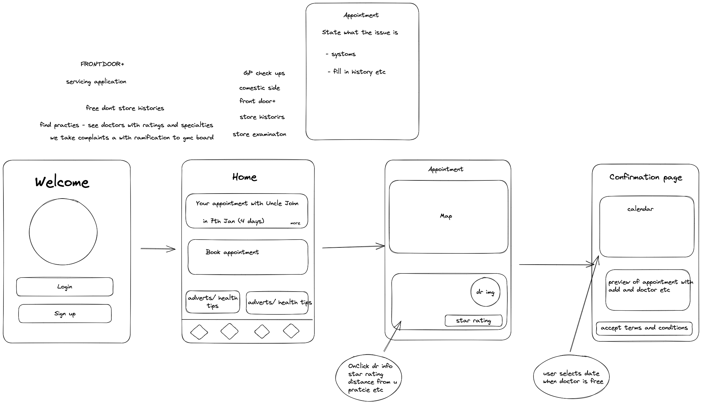

#FrontDoor

##Features

##Vision

##Backend

- used mvn for  
- SpringBoot with MongoDB reporisty (unable to seee database but assuming its workinG lol)
- switch to serverless database for real time updates? firebase? 
- Endpoints work but returning 204 on params that arent in database, rather return seperate error or return     seperate info to user   

##FrontEnd

- We will be using react native for quick shipping 

- Do we need redux? thunk? 

- styling 
