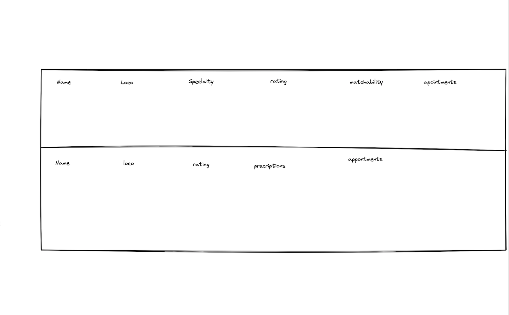
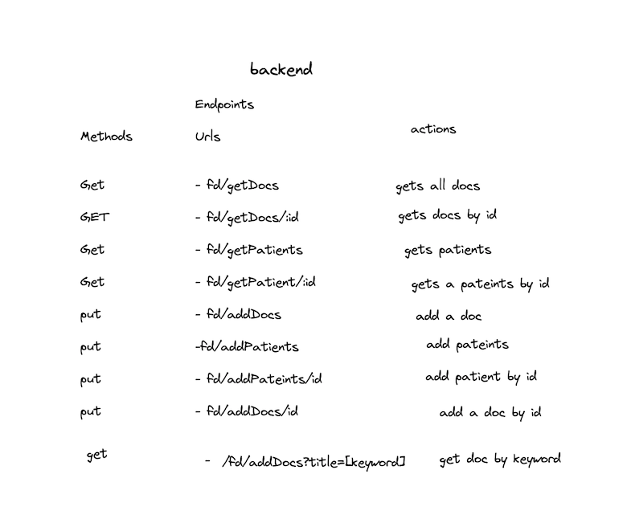
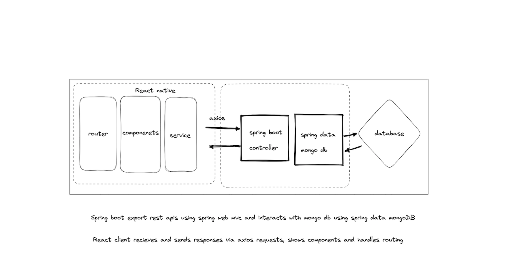
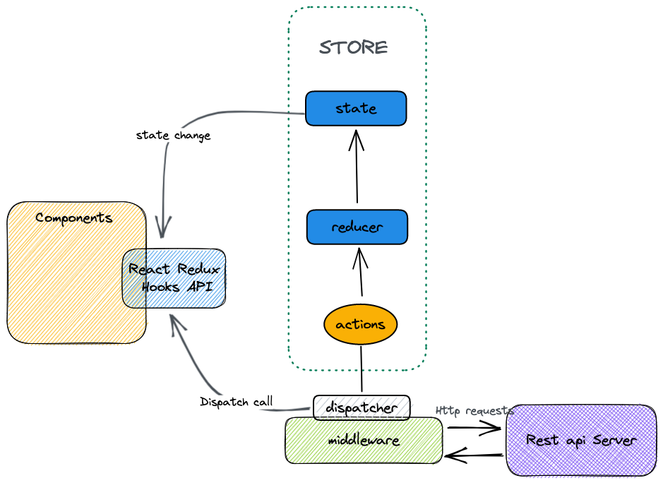

# FrontDoor

## Features

## Vision

## Backend

- used mvn for  
- SpringBoot with MongoDB reporisty (unable to seee database but assuming its workinG lol)
- switch to serverless database for real time updates? firebase? 

- Endpoints work but returning 204 on params that arent in database, rather return seperate error or return     seperate info to user   

## FrontEnd

- We will be using react native for quick shipping 

- Do we need redux? thunk? 

- styling 

### FrontEnd vison

- hoping to create a one page rendering application in react 

- In react native would potenitally need two seprate apps but a login page for docs to acces patients and vice versa for pateints

